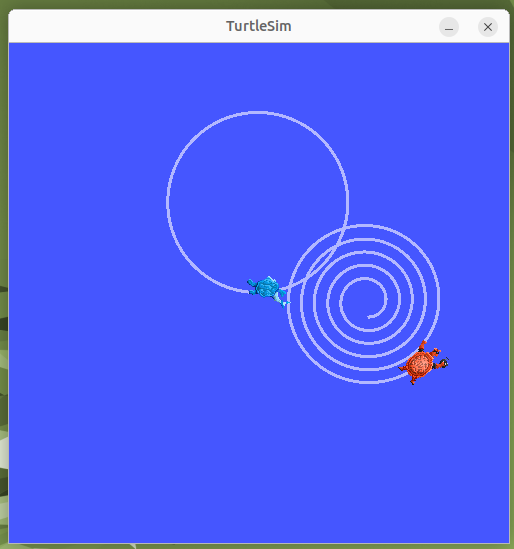

# 🐢 ROS2 Turtlesim – Circle and Spiral Movement

This project demonstrates how to control two turtles in the turtlesim simulator using ROS 2 Humble.

- **Turtle 1** moves in a circle.
- **Turtle 2** moves in a spiral.

## 🛠 Requirements

- Ubuntu 22.04  
- ROS 2 Humble
- turtlesim package  
- Python 3

## 🚀 How to Run

1. Start the turtlesim node:

   ```bash
   ros2 run turtlesim turtlesim_node
   ```
 2. Spawn a second turtle:

    ```bash
    ros2 service call /spawn turtlesim/srv/Spawn "{x: 8.0, y: 5.0, theta: 0.0, name: 'turtle2'}"
    ```
3. Run the movement scripts:
   ```bash
   python3 circle_turtle1.py
   python3 spiral_turtle2.py
   ```
## 📸 Screenshot

Below is the result of the turtle movements:



## 🐍 Python Scripts
**circle_turtle1.py**
This script controls turtle1 to move in a circular path by setting a constant linear velocity and a fixed angular velocity.

**spiral_turtle2.py**
This script controls turtle2 to move in a spiral shape by gradually increasing its linear velocity while keeping a steady angular velocity.
